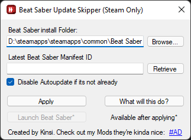

# BeatSaber UpdateSkipper
Simple tool to prevent Steam from Updating Beat Saber whenever there happens to be an update

  

# How to use

## 1. DISABLE AUTO UPDATING OF BEAT SABER IN STEAM BEFORE THERE IS AN UPDATE!

#### 2. Download the latest version of the application from [the releases](https://github.com/kinsi55/BeatSaber_UpdateSkipper/releases)

3. Rest should be pretty much self explanatory. Whenever Steam wants you to update Beat Saber you can make use of this to prevent it from actually updating.
